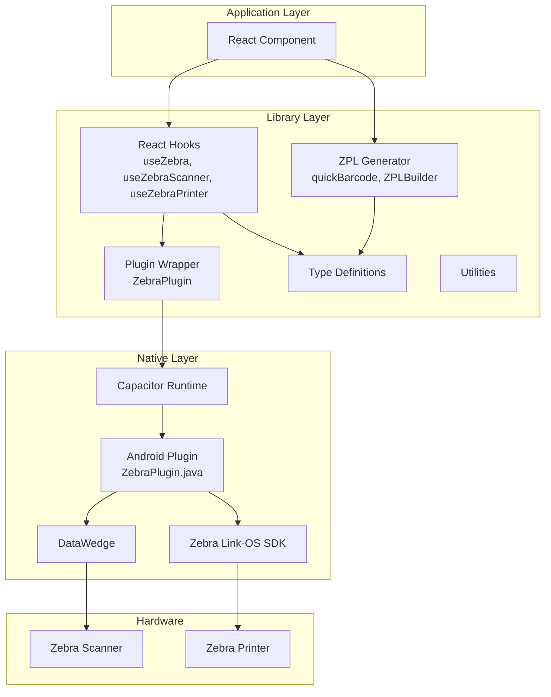
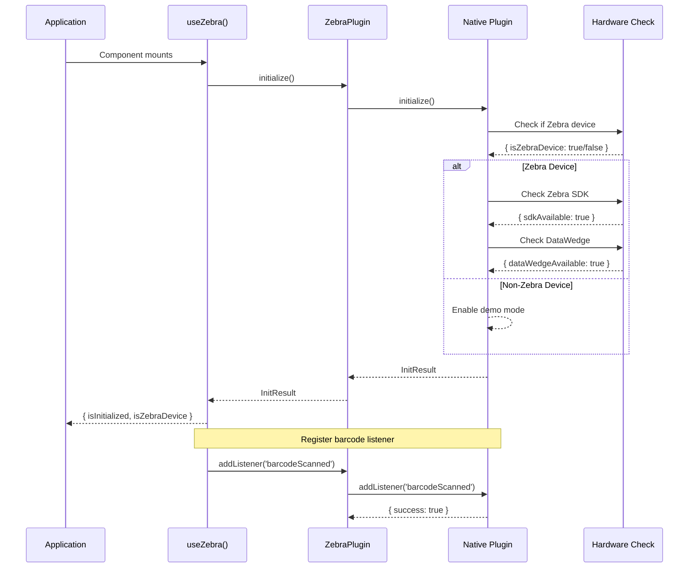
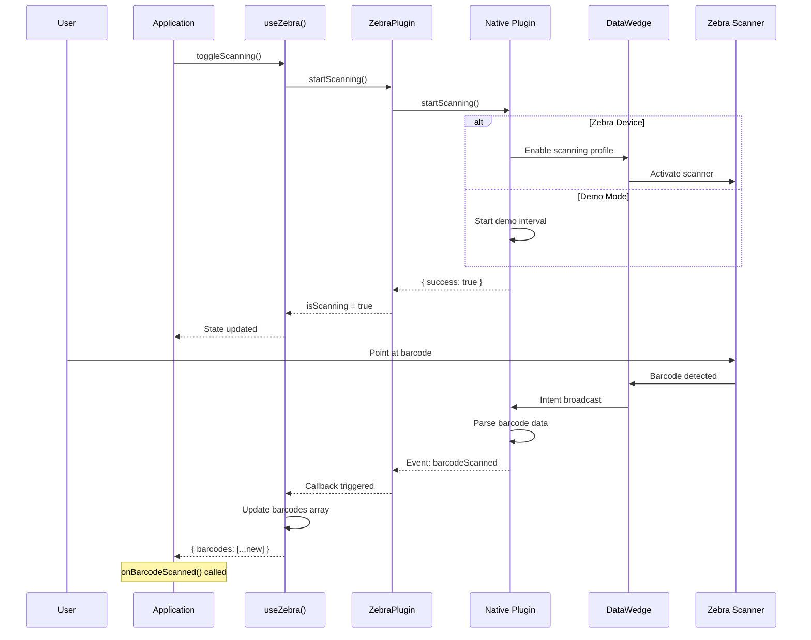
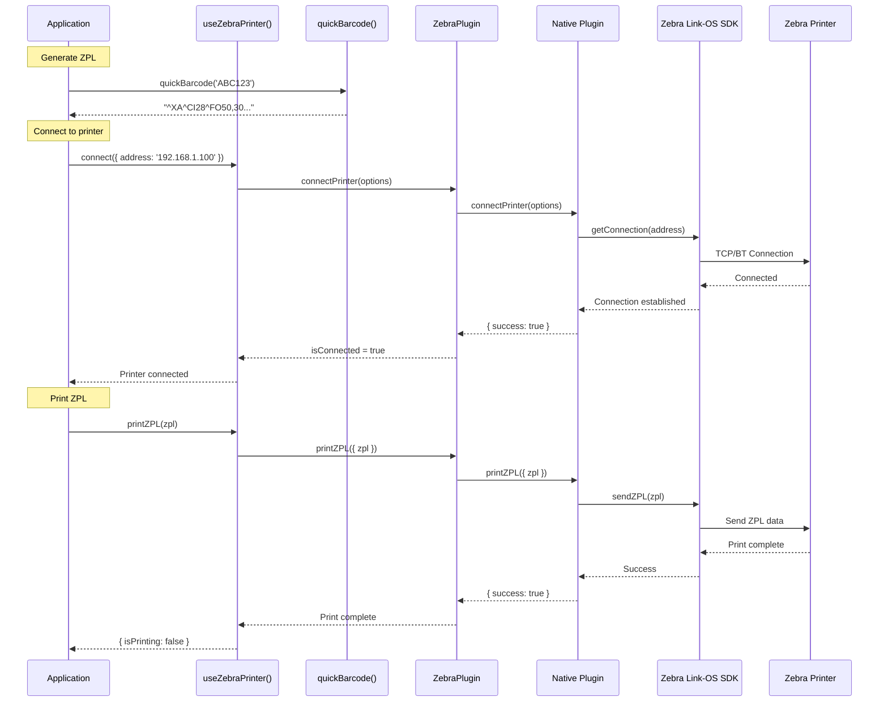
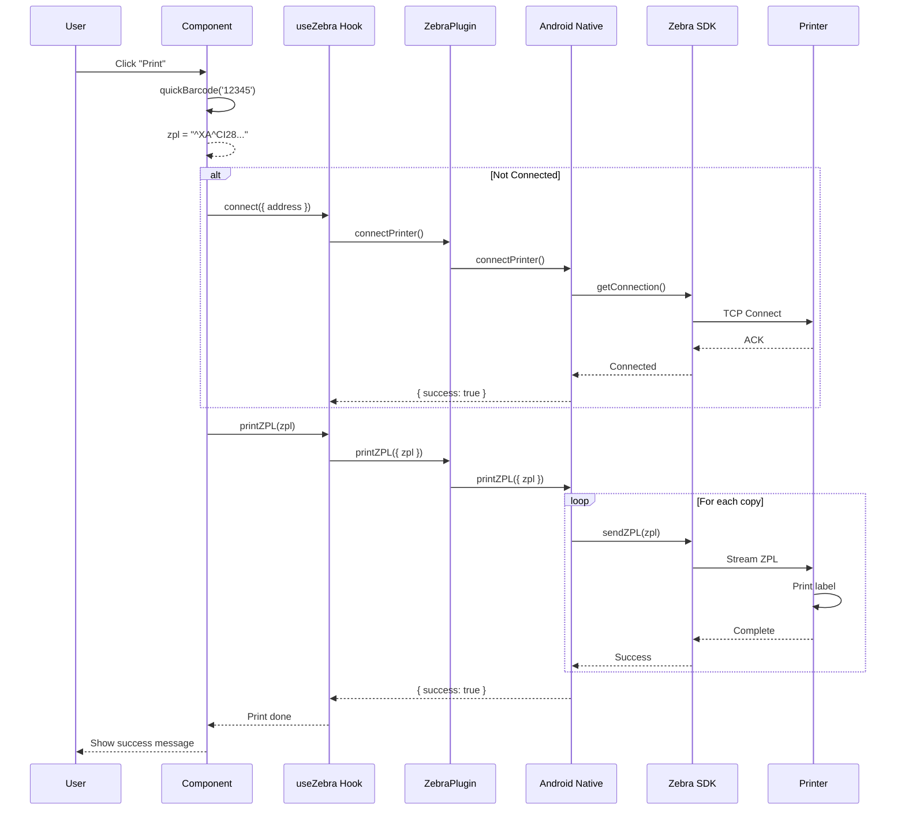
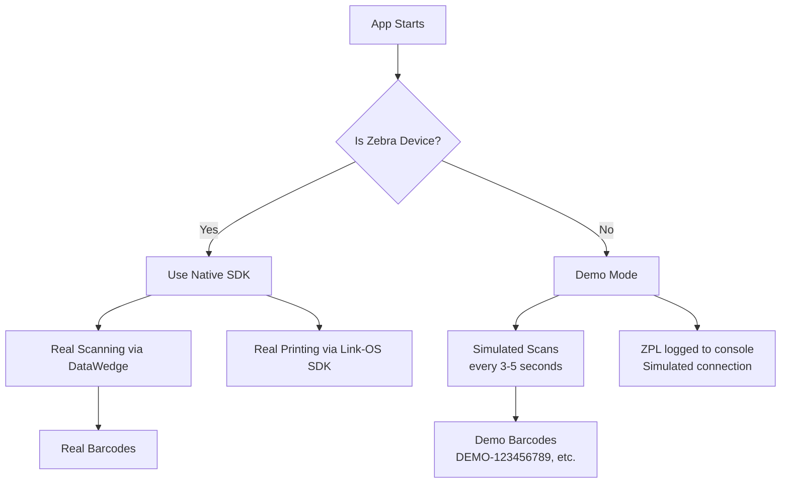

# Zebra Scanner & Printer Library

A TypeScript library for Zebra barcode scanning and printing on Android devices using Capacitor.

## Installation

```bash
npm install @capacitor/core @capacitor/android
```

Copy the `src/lib/` folder to your project or install as a local package.

## Quick Start

```typescript
import { useZebra, quickBarcode } from '@/lib';

function App() {
  const { barcodes, printZPL, isConnected } = useZebra();
  
  // Print a simple barcode label
  const handlePrint = () => printZPL(quickBarcode('ABC123'));
  
  return <button onClick={handlePrint}>Print</button>;
}
```

---

## Architecture Overview



---

## Sequence Diagrams

### 1. Initialization Flow



### 2. Barcode Scanning Flow



### 3. Printing Flow



### 4. Complete Print Workflow



---

## API Reference

### React Hooks

#### `useZebra(options?)`

Combined hook for scanner and printer.

```typescript
const {
  // Scanner
  barcodes,          // BarcodeResult[]
  isScanning,        // boolean
  toggleScanning,    // () => Promise<void>
  clearBarcodes,     // () => void
  
  // Printer
  printers,          // PrinterInfo[]
  connect,           // (options) => Promise<boolean>
  disconnect,        // () => Promise<void>
  printZPL,          // (zpl: string) => Promise<boolean>
  isConnected,       // boolean
  connectedPrinter,  // PrinterInfo | null
  
  // General
  isInitialized,     // boolean
  isZebraDevice,     // boolean
  error,             // string | null
} = useZebra({
  autoStartScanning: false,
  autoDiscoverPrinters: true,
  onBarcodeScanned: (barcode) => console.log(barcode.data),
  onError: (error) => console.error(error),
});
```

#### `useZebraScanner(options?)`

Scanner-only hook.

```typescript
const {
  barcodes,
  isScanning,
  startScanning,
  stopScanning,
  toggleScanning,
  clearBarcodes,
  isInitialized,
} = useZebraScanner({
  maxBarcodeHistory: 50,
  onBarcodeScanned: (barcode) => {},
});
```

#### `useZebraPrinter(options?)`

Printer-only hook.

```typescript
const {
  printers,
  connectedPrinter,
  isConnected,
  isPrinting,
  status,
  discoverPrinters,
  connect,
  disconnect,
  print,
  printZPL,
} = useZebraPrinter({
  autoDiscoverPrinters: true,
  onPrinterConnected: (printer) => {},
});
```

---

### ZPL Generation

#### Quick Functions

```typescript
import { quickBarcode, quickBarcodeLabel } from '@/lib';

// Simplest - just pass barcode text
const zpl = quickBarcode('ABC123');
// ^XA^CI28^FO50,30^BCN,100,Y,N,N^FDABC123^FS^XZ

// With options
const zpl = quickBarcodeLabel('ABC123', {
  x: 50,
  y: 30,
  height: 80,
  showText: true,
});
```

#### ZPLBuilder Class

```typescript
import { ZPLBuilder } from '@/lib';

const zpl = new ZPLBuilder({ width: 4, height: 2 })
  .text(50, 30, 'Product Name', { font: 'D', fontHeight: 30 })
  .barcode128(50, 80, 'ABC123', { height: 80, printText: true })
  .qrcode(400, 80, 'https://example.com', { size: 6 })
  .box(30, 200, 540, 2, 2)
  .build();
```

#### Pre-built Templates

```typescript
import { LABEL_TEMPLATES, generateFromTemplate } from '@/lib';

// Generate using template ID
const zpl = generateFromTemplate('product-label', {
  barcode: '123456789',
  productName: 'Widget',
  price: '$9.99',
  sku: 'WGT-001',
});
```

---

### Plugin Direct Access

```typescript
import { ZebraPlugin } from '@/lib';

// Initialize
const result = await ZebraPlugin.initialize();

// Add barcode listener
await ZebraPlugin.addBarcodeListener((barcode) => {
  console.log('Scanned:', barcode.data);
});

// Start scanning
await ZebraPlugin.startScanning();

// Connect and print
await ZebraPlugin.connectPrinter({ address: '192.168.1.100:9100' });
await ZebraPlugin.printZPL(quickBarcode('ABC123'));
```

---

## Types

```typescript
interface BarcodeResult {
  data: string;           // Decoded barcode string
  symbology: string;      // CODE128, EAN-13, QR, etc.
  timestamp: number;      // Unix timestamp
  isSpecialZebra: boolean; // Zebra config barcode
  rawBytes?: number[];    // Raw bytes from scanner
}

interface PrinterInfo {
  name: string;
  address: string;        // MAC or IP:PORT
  type: 'bluetooth' | 'wifi' | 'usb';
  isOnline: boolean;
}

interface PrinterStatus {
  isReady: boolean;
  isPaused: boolean;
  isHeadOpen: boolean;
  isPaperOut: boolean;
  isRibbonOut: boolean;
  messages: string[];
}

interface PrintOptions {
  content: string;
  format?: 'text' | 'zpl' | 'cpcl' | 'pdf' | 'image';
  copies?: number;
  width?: number;
  height?: number;
}

interface InitResult {
  success: boolean;
  message: string;
  isZebraDevice?: boolean;
  sdkAvailable?: boolean;
  dataWedgeAvailable?: boolean;
}
```

---

## Demo Mode

The library automatically detects non-Zebra devices and runs in demo mode:



Demo mode features:
- Simulated barcode scans every 3-5 seconds
- Mock printer discovery
- ZPL logged to console instead of printing
- All hooks and APIs work identically

---

## Project Structure

```
src/lib/
├── index.ts           # Main exports
├── types/
│   └── index.ts       # TypeScript interfaces
├── hooks/
│   └── index.ts       # React hooks
│       ├── useZebraScanner()
│       ├── useZebraPrinter()
│       └── useZebra()
├── zpl/
│   └── generator.ts   # ZPL generation
│       ├── quickBarcode()
│       ├── ZPLBuilder class
│       └── LABEL_TEMPLATES
├── plugin/
│   └── index.ts       # Capacitor plugin wrapper
└── utils/
    └── index.ts       # Helper utilities
```

---

## Troubleshooting

### Barcode listener not working

```typescript
// Make sure to await the listener registration
await ZebraPlugin.addBarcodeListener(callback);
await ZebraPlugin.startScanning();
```

### Printer not connecting

1. Check printer is powered on
2. Verify address format:
   - WiFi: `192.168.1.100:9100`
   - Bluetooth: `00:11:22:33:44:55`
3. Ensure Bluetooth permissions granted

### Demo mode on Zebra device

Check `initResult.isZebraDevice`:
```typescript
const { initResult } = useZebra();
console.log('Zebra device:', initResult?.isZebraDevice);
```

---

## License

MIT
